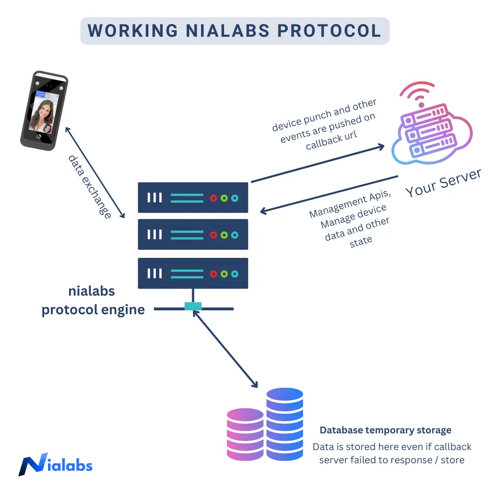

# Overview

Let's discover **Nialabs APIS in less than 5 minutes**.

## Getting Started - Biometric Web Api V1
### Nialabs Engine Top Level Design

Receiving realtime data from nialabs server is very easy to integrate.
You just need to enable a POST url on your server on which our server will send realtime push data.


### What you'll need

- Your cloud server webhook(callback) url
- On this url nialabs server will send push data.


## Nialabs portal
After purchasing the devices / or apis you will be given credentials of our APIS monitor portal.


## Types of APIS
 
 ***Callback API***
 
Punch data and other events pushed to your server(on callback url) realtime.

 ***Management API***
 
 Your server will call nialabs api to add / update data on device and manage device states.


### Format of Apis
- every request originating either from your server or from nialabs server contains two types of data.
- one is query params. i.e. `stgid=xxxx`, where `xxxx` is the service tag number or serial number of the device.
- other is post data. which contains the data of the punch / user / device 

#### Following is the format of the data pushed in body section of the http request.
All the request must be in the specified format

```js
  {
    ["operation"] : {
      ["operationType"] : {"operationData"},
      "OperationID": "string",
      "AuthToken": "string",
    }
  }
```
1.  **operation** : the type of request operation. i.e. Realtime / Add / Load / Delete and so on.  
2.  **operationType** : specified the type of the operation i.e. User / Photo / Template and so on.
3.  **operationData** : the actual data of the operation required to perform the logic. the format varies based on the operation and operation type.
4.  **OperationID** : the unique operation id for the operation.
5.  **AuthToken** : (optional) required to validate the authenticity of the request. 
